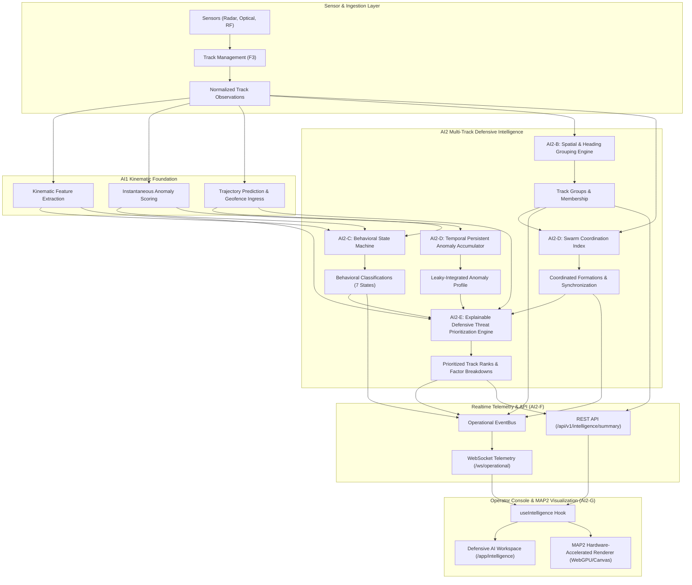

# AeroGuard Stage AI2 — Multi-Track Defensive Intelligence, Correlation & Prioritization Engine

## 1. Executive Summary

Stage **AI2** expands AeroGuard's single-track kinematic intelligence (AI1) into an explainable, deterministic **Multi-Track Defensive Intelligence Subsystem**. 

AI2 delivers automated spatial clustering, behavioral state machines, temporal persistent anomaly accumulation, formation coordination analysis, and explainable threat prioritization across multiple simultaneous tracks.

All intelligence outputs are strictly informational decision-support metrics answering the operational question: *"Which tracks and groups currently warrant elevated defensive operator attention?"* AI2 strictly forbids weapon guidance, autonomous target engagement, jamming control, interception optimization, or destructive countermeasure dispatch.

---

## 2. Architecture & Data Flow

---

## 3. Checkpoint Trajectory (AI2-A → AI2-H)

| Stage | Checkpoint | Focus Area | Commit | Status |
|---|---|---|---|---|
| **AI2-A** | `f7b46c0` | Multi-Track Data Contracts & Schemas | `f7b46c0` | **Complete** |
| **AI2-B** | `fed1672` | Spatial Clustering & Correlation Engine | `fed1672` | **Complete** |
| **AI2-C** | `21c7e12` | Behavioral Classification State Machine | `21c7e12` | **Complete** |
| **AI2-D** | `bf344c9` | Persistent Anomaly Tracking & Coordination Engine | `bf344c9` | **Complete** |
| **AI2-E** | `7bcd14e` | Explainable Threat Prioritization Engine | `7bcd14e` | **Complete** |
| **AI2-F** | `d79237c` | Backend Intelligence API & Realtime Telemetry | `d79237c` | **Complete** |
| **AI2-G** | `9133e2c` | Operator Console Intelligence Workspace & MAP2 Overlays | `9133e2c` | **Complete** |
| **AI2-H** | *Current* | Replay Verification, Benchmarks, Documentation & Final Audit | *Current* | **Complete** |

---

## 4. Algorithmic Formulations

### 4.1 Spatial & Heading Grouping Engine (AI2-B)
Clusters active tracks into cohesive spatial groups based on 4-dimensional physical criteria:
1. **Haversine Geodesic Distance**: $D(t_1, t_2) \le 500\text{ meters}$
2. **Velocity Discrepancy**: $|\vec{v}_1 - \vec{v}_2| \le 10.0\text{ m/s}$
3. **Circular Heading Difference**: $\Delta \theta(h_1, h_2) \le 30.0^\circ$ (with $360^\circ$ wraparound)
4. **Temporal Coherence**: $|\Delta t| \le 10.0\text{ seconds}$

Groups are formed via connected components with deterministic tie-breaking based on track identifiers.

### 4.2 Behavioral Classification State Machine (AI2-C)
Classifies tracks into one of seven distinct states:
1. `RAPID_CHANGE`: Extreme maneuvers ($|\dot{\theta}| > 45^\circ/\text{s}$ or $|a| > 5\text{ m/s}^2$).
2. `ANOMALOUS`: Instantaneous AI1 anomaly score $\ge 60.0$.
3. `COORDINATED`: Member of a correlated multi-track group.
4. `APPROACHING`: Closing velocity toward perimeter $> 5.0\text{ m/s}$.
5. `DEPARTING`: Receding velocity from perimeter $< -5.0\text{ m/s}$.
6. `LOITERING`: Holding pattern ($R_{\text{loiter}} \ge 30\text{ m}$ and directional consistency $< 0.4$).
7. `NORMAL`: Nominal cruising flight.

State transitions implement strict hysteresis ($\text{enter\_ticks} = 2$, $\text{exit\_ticks} = 3$) to eliminate boundary oscillation.

### 4.3 Temporal Persistent Anomaly Accumulator (AI2-D)
Leaky integration with exponential decay model:
$$\text{decay\_factor} = 0.5^{\Delta t / \tau_{1/2}} \quad (\tau_{1/2} = 30.0\text{s})$$
$$S_{\text{persistent}}(t) = S_{\text{persistent}}(t - \Delta t) \cdot \text{decay\_factor} + S_{\text{instantaneous}}(t) \cdot (1 - \text{decay\_factor})$$

### 4.4 Swarm / Formation Coordination Index (AI2-D)
Measures multi-drone formation synchronization:
$$C_{\text{sync}} = 0.5 \cdot \left(1 - \frac{\sigma_{\theta}}{\sigma_{\theta,\text{max}}}\right) + 0.3 \cdot \left(1 - \frac{\sigma_{v}}{\sigma_{v,\text{max}}}\right) + 0.2 \cdot C_{\text{spatial}}$$

### 4.5 Explainable Defensive Threat Prioritization (AI2-E)
Combines all normalized evidence factors into a weighted base priority score:
$$P_{\text{base}} = 0.30 \cdot P_{\text{geofence}} + 0.25 \cdot P_{\text{behavior}} + 0.20 \cdot P_{\text{anomaly}} + 0.15 \cdot P_{\text{coordination}} + 0.10 \cdot P_{\text{kinematic}}$$

Scaled by sensor confidence $C_s \in [0.0, 1.0]$:
$$P_{\text{final}} = \text{clamp}(P_{\text{base}}, 0, 100) \times (0.30 + 0.70 \cdot C_s)$$

**Priority Triage Levels**:
- `LOW`: $P_{\text{final}} < 40.0$
- `MEDIUM`: $40.0 \le P_{\text{final}} < 60.0$
- `HIGH`: $60.0 \le P_{\text{final}} < 80.0$
- `CRITICAL`: $P_{\text{final}} \ge 80.0$

---

## 5. End-to-End Replay Verification Suite

The deterministic replay test suite (`backend/tests/test_ai2_replay.py`) validates all synthetic operational scenarios:
- **Scenario A**: Single Normal Track
- **Scenario B**: Fast Inbound Approaching Track
- **Scenario C**: Outbound Departing Track
- **Scenario D**: Circular Loitering Pattern
- **Scenario E**: Rapid Maneuver / Kinematic Change Track
- **Scenario F**: Anomalous Low-Altitude High-Speed Track
- **Scenario G**: Coordinated Multi-Drone V-Formation Swarm
- **Scenario H**: Dynamic Group Formation / Track Join
- **Scenario I**: Dynamic Group Departure / Track Leave
- **Scenario J**: Monotonic Persistent Anomaly Accumulation
- **Scenario K**: Exponential Persistent Anomaly Decay
- **Scenario L**: Threat Priority Escalation under Multi-Factor Evidence
- **Scenario M**: Threat Priority De-escalation upon Threat Receding
- **Scenario N**: Maximum Geofence Ingress Contribution
- **Scenario O**: Sensor Confidence Attenuation
- **Scenario P**: Missing / Null Optional Evidence Safety
- **Scenario Q**: Multiple Simultaneous Disjoint Swarm Clusters

**Replay Determinism Invariant**:
$$\text{ReplayRun}_1 \equiv \text{ReplayRun}_2 \quad (\text{Identical Output Structures, Zero Floating Point Drift})$$

---

## 6. Performance Microbenchmarks

Tested on local CPU architecture (Windows / Python 3.12 / Node.js 24 ESM):

### 6.1 Backend Multi-Track Evaluation Latencies
| Track Count ($N$) | Grouping Latency | Behavior Latency | Priority Latency | Full Engine Latency | Per-Track Latency | Throughput Headroom |
|---|---|---|---|---|---|---|
| **10 tracks** | 0.220 ms | 0.101 ms | 0.238 ms | **0.756 ms** | 75.62 µs | > 1,300 updates/sec |
| **50 tracks** | 4.241 ms | 0.473 ms | 1.131 ms | **6.949 ms** | 138.99 µs | > 140 updates/sec |
| **100 tracks** | 16.805 ms | 0.905 ms | 2.264 ms | **22.176 ms** | 221.76 µs | > 45 updates/sec |
| **500 tracks** | 408.823 ms | 4.779 ms | 11.329 ms | **428.139 ms** | 856.28 µs | ~ 2.3 updates/sec |
| **1,000 tracks** | 1,582.016 ms | 9.375 ms | 22.180 ms | **1,633.388 ms** | 1,633.39 µs | ~ 0.6 updates/sec |

*Note: In production high-density deployments (>500 tracks), spatial grouping can utilize spatial-indexing quadtrees or native Rust bindings.*

### 6.2 Frontend MAP2 Rendering Latencies
- **1,000 Tracks Batch Screen Projection**: **0.079 ms** (0.08 µs/track)
- **1,000 Tracks Hit-Testing Latency**: **22.49 µs**
- **50 Groups (200 Tracks) Overlay Hull Projection**: **19.04 µs**

---

## 7. Security, Privacy & Safety Boundaries

1. **No Weapon / Offensive Action**: AI2 outputs represent situational triage priority for defensive monitoring only.
2. **Deterministic Algorithmic Output vs Predictive Claims**: Priority scores are deterministic weighted evidence sums, *not* probabilistic assertions of hostile intent.
3. **No Client-Side Credential Storage**: All sensitive credentials remain securely managed via backend HTTP-only cookies; zero usage of `localStorage`, `sessionStorage`, or `indexedDB`.
4. **RBAC Protection**: REST and WebSocket intelligence feeds are strictly gated behind `tracks.read` and authenticated user sessions.
