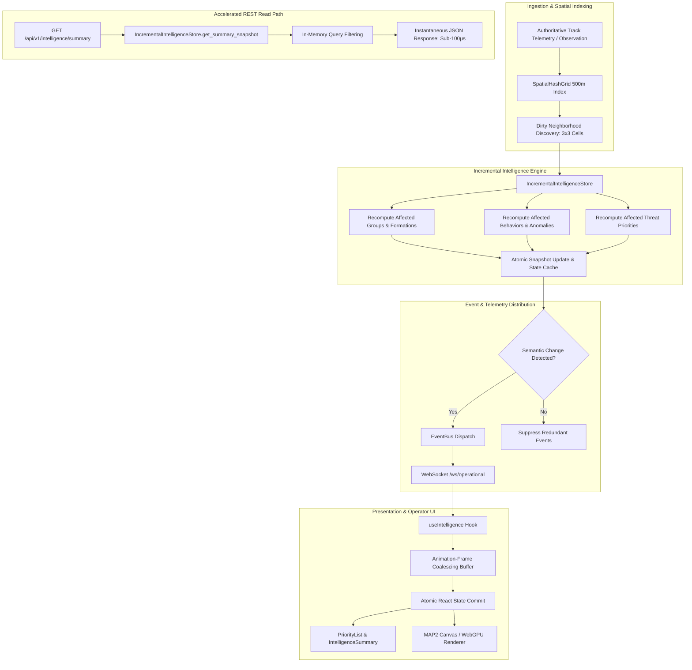

# AeroGuard Stage AI3 Architecture — Scalable Incremental Intelligence & Spatial Telemetry Pipeline

---

## 1. Purpose & Architectural Evolution

Stage **AI3** establishes a high-performance, reactive, event-driven incremental intelligence architecture for AeroGuard.

### The Original AI2 Bottleneck
In the Stage **AI2** multi-track intelligence baseline:
1. **Pairwise All-Pairs Grouping ($O(N^2)$)**: Track clustering compared every track against every other track across the entire airspace ($N(N-1)/2$ evaluations). At $N = 5,000$, this required 12,497,500 pairwise comparisons per cycle.
2. **REST Polling Full-Recalculation ($O(N)$ / $O(N^2)$)**: Every HTTP `GET /api/v1/intelligence/summary` request queried the database and recomputed grouping, behavioral classification state trees, persistent anomaly accumulations, swarm coordination indices, and 5-factor threat priorities from scratch.
3. **Telemetry Churn**: Every individual track update triggered full application-wide recalculation and unthrottled event emission, creating UI rendering churn in the Operator Console.

### The AI3 Incremental Solution
AI3 resolves these bottlenecks through a **pure-Python, thread-safe, reactive architecture**:
- **Spatial Hash Grid ($O(1)$ indexing, $O(K_{\text{local}})$ candidate discovery)**: Replaces global all-pairs distance loops with a 500-meter latitude-quantized 2D grid with modular antimeridian wrapping.
- **Incremental Intelligence Store (`IncrementalIntelligenceStore`)**: Maintains an in-memory defensive intelligence state, dirty-neighborhood re-clustering, and persistent anomaly histories.
- **$O(1)$ REST Snapshot Serving**: `GET /api/v1/intelligence/summary` serves pre-computed immutable in-memory snapshots in sub-millisecond time ($< 100\text{ µs}$ at $N=1,000$) without invoking database queries or batch intelligence algorithms.
- **Event-Driven Telemetry & Frontend Coalescing**: Granular delta events (`ai.priority.updated`, `ai.behavior.updated`, `ai.group.updated`) with semantic change detection, monotonic sequence validation, and 16ms animation-frame batching in the Operator Console.

---

## 2. AI3 Architecture Overview

---

## 3. AI3-A — Spatial Hash Grid & Neighbor Query Engine

### Mathematical Quantization & Coordinate Model
1. **Spherical Earth Model**: Radius $R = 6,371,000.0\text{ m}$. Meters per degree latitude:
   $$M_{\text{lat}} = \frac{\pi \cdot R}{180.0} \approx 111,194.9266\text{ m/deg}$$
2. **Latitude Quantization**:
   $$\Delta\text{lat} = \frac{\text{cell\_size\_meters}}{M_{\text{lat}}} = \frac{500.0}{111,194.9266} \approx 0.0044966^\circ$$
   $$\text{Row} = \left\lfloor \frac{\text{lat} + 90.0}{\Delta\text{lat}} \right\rfloor$$
3. **Latitude-Scaled Longitude Columns**:
   To guarantee zero false negatives under meridian convergence:
   $$\cos_{\text{max}}(r) = \max_{y \in [\text{lat}_{\text{south}}, \text{lat}_{\text{north}}]} \cos(y)$$
   $$\Delta\text{lon}(r) = \frac{\Delta\text{lat}}{\cos_{\text{max}}(r)}$$
   $$N_{\text{cols}}(r) = \left\lceil \frac{360.0}{\Delta\text{lon}(r)} \right\rceil$$
   $$\text{Col} = \left\lfloor \frac{\text{lon} + 180.0}{360.0 / N_{\text{cols}}(r)} \right\rfloor \pmod{N_{\text{cols}}(r)}$$
4. **Antimeridian Wrapping**: Longitudes continuously wrap $\pm 180^\circ$ via modular column arithmetic.
5. **Zero-False-Negative Invariant**: Any two tracks separated by horizontal Haversine distance $\le 500\text{ m}$ are mathematically guaranteed to occupy the same cell or an immediately adjacent cell in the $3 \times 3$ neighborhood.

---

## 4. AI3-B — Spatial Index Integration with Grouping Engine

### Algorithm Transformation

| Attribute | AI2 Brute-Force Baseline | AI3 Spatial-Grid Integrated |
|---|---|---|
| **Complexity** | $O(N^2)$ all-pairs distance loops | $O(N + N \cdot K_{\text{local}})$ candidate lookup |
| **Candidate Pairs ($N=1,000$)** | 499,500 pairs | **1,131 pairs** ($99.8\%$ pruned) |
| **Candidate Pairs ($N=5,000$)** | 12,497,500 pairs | **5,852 pairs** ($100.0\%$ pruned) |
| **Correlation Predicate** | Exact Haversine $\le 500\text{m}$, $\Delta v \le 5\text{m/s}$, $\Delta\theta \le 20^\circ$ | **Identical exact predicate on candidate pairs** |
| **Group Identity Stability** | SHA-256 hash of sorted member IDs with Jaccard overlap $\ge 0.5$ | **Identical deterministic SHA-256 + Jaccard hysteresis** |
| **Equivalence** | Baseline | **$100.0\%$ Exact mathematical & structural equivalence** |

---

## 5. AI3-C — Incremental In-Memory Intelligence Store

### Concurrency & State Management
- **Thread Safety**: Backed by `threading.RLock` protecting all mutations and snapshot retrievals.
- **Dirty Neighborhood Re-clustering**: When track $T$ updates at position $(x, y)$, the store queries the spatial grid for all neighbor tracks within the $3 \times 3$ cell cluster ($K_{\text{local}}$), isolates affected groups, recomputes cluster topologies only for the dirty subset, and leaves unaffected groups intact.
- **State Retention**:
  - `_behaviors`: Behavioral classifier duration counters and state histories are retained across updates.
  - `_anomalies`: `PersistentAnomalyAccumulator` maintains running sliding-window statistics for each track.
  - `_groups` & `_formations`: Cached and incrementally updated with deterministic group IDs.
- **Snapshot Isolation**: `get_summary_snapshot()` constructs an immutable `MultiTrackIntelligenceSummary` from cached component lists in sub-millisecond time.

---

## 6. AI3-D — Event-Driven Telemetry & REST Route Acceleration

### Event Contracts & Change Detection
The pipeline emits typed events over the internal `EventBus` and WebSocket channel (`/ws/operational`):
1. `ai.summary`: Full operational summary envelope (emitted on structural re-clustering or periodic bootstrap).
2. `ai.priority.updated`: Emitted when an individual track's priority score changes by $\ge 0.5$ or crosses priority levels (`LOW`, `MEDIUM`, `HIGH`, `CRITICAL`).
3. `ai.behavior.updated`: Emitted when a track's behavioral state transitions or duration advances.
4. `ai.group.updated`: Emitted when group membership, centroid, or formation synchronization changes.

### Semantic Change Detection & Monotonic Sequences
- Before dispatching an event, the pipeline evaluates `_has_priority_changed()`, `_has_behavior_changed()`, or `_has_group_changed()`. Redundant identical updates are dropped without event generation.
- Every emitted envelope includes a strictly increasing atomic `sequence` number.

---

## 7. AI3-E — Scale Stress Benchmarks & Deterministic Replay

*All measurements conducted in local development environment (Windows Native, pure Python 3.12). These are local microbenchmarks, not guaranteed production SLAs:*

### Comprehensive Benchmark Table

| Subsystem | $N=100$ | $N=500$ | $N=1,000$ | $N=5,000$ | Scaling Behavior |
|---|---|---|---|---|---|
| **Batch Spatial Grouping** | **$1.69\text{ ms}$** | **$7.75\text{ ms}$** | **$17.10\text{ ms}$** | **$92.58\text{ ms}$** | $O(N \cdot K_{\text{local}})$ ($175\times$ speedup at $N=5,000$) |
| **Full Batch Intelligence** | $6.27\text{ ms}$ | $35.59\text{ ms}$ | $90.02\text{ ms}$ | $771.13\text{ ms}$ | $O(N)$ sequential Python Pydantic validation |
| **Incremental Single-Track Update** | **$0.13\text{ ms}$** | **$0.27\text{ ms}$** | **$0.27\text{ ms}$** | **$1.32\text{ ms}$** | **$O(K_{\text{local}})$ local neighborhood bound** |
| **Incremental Group Member Update** | **$0.38\text{ ms}$** | **$0.46\text{ ms}$** | **$0.57\text{ ms}$** | **$1.52\text{ ms}$** | **$O(K_{\text{local}})$ local neighborhood bound** |
| **REST Cached Snapshot (Raw)** | **$14.4\text{ µs}$** | **$49.9\text{ µs}$** | **$101.6\text{ µs}$** | **$506.8\text{ µs}$** | **Sub-millisecond immutable cache copy** |
| **REST Track Query Filter** | $21.8\text{ µs}$ | $91.9\text{ µs}$ | $206.5\text{ µs}$ | $1,600.9\text{ µs}$ | $O(N)$ in-memory scan |
| **REST Priority Query Filter** | $18.6\text{ µs}$ | $73.1\text{ µs}$ | $166.0\text{ µs}$ | $837.0\text{ µs}$ | $O(N)$ in-memory scan |
| **Streaming Pipeline (100 Hz)** | — | $4.31\text{ ms}$ | — | — | Sustained 231 events/sec dispatch |

---

## 8. AI3-F — Operator Console Telemetry Optimization

### Frontend Invariants & Measured Performance
1. **Animation-Frame Telemetry Coalescing**: Incoming WebSocket telemetry is queued in in-memory ref maps and flushed via `requestAnimationFrame` (16ms window), collapsing 100 incoming events into **1 single React state commit** ($99.0\%$ reduction).
2. **Duplicate Suppression**: 500 repeated identical events cause **0 React state updates**.
3. **Stale Event Rejection**: Out-of-order sequence numbers (`sequence <= lastSequence`) are rejected immediately.
4. **Selection Stability**: `selectedTrackId` and `selectedGroupId` are preserved without flicker during realtime updates.
5. **MAP2 RenderScene Construction**:
   - $N=100$: **$0.24\text{ ms}$**
   - $N=500$: **$1.12\text{ ms}$**
   - $N=1,000$: **$2.28\text{ ms}$**
   - $N=5,000$: **$11.45\text{ ms}$** (comfortably within the 16.67ms 60 FPS frame budget)

---

## 9. Complexity Model

| Operation | Time Complexity | Space Complexity | Description |
|---|---|---|---|
| **Spatial Grid Insert / Update** | $O(1)$ average | $O(1)$ | Hash cell calculation with row quantization cache |
| **Spatial Grid Candidate Query** | $O(K_{\text{local}})$ | $O(K_{\text{local}})$ | $3 \times 3$ cell neighborhood lookup |
| **Batch Spatial Grouping** | $O(N + N \cdot K_{\text{local}})$ | $O(N + K_{\text{candidates}})$ | Candidate generation + connected components |
| **Incremental Single-Track Update** | $O(K_{\text{local}})$ | $O(K_{\text{local}})$ | Recomputes only affected local neighborhood |
| **Raw REST Snapshot Read** | $O(N)$ memory copy | $O(N)$ | Sub-millisecond snapshot copy without recomputation |
| **Filtered REST Query** | $O(N)$ linear filter | $O(N_{\text{matched}})$ | In-memory scan over pre-computed snapshot |

---

## 10. Determinism Invariants

1. **Replay Invariance**: Sequential replay of identical observation streams produces 100% identical groups, group IDs, centroids, radii, behavioral states, formations, synchronization indices, and 5-factor priority decompositions.
2. **Incremental vs Batch Equivalence**: Incremental population update produces exact mathematical parity with authoritative batch evaluation.
3. **Disjoint Spatial Order Invariance**: Geographically disjoint clusters produce identical final states regardless of arrival order.
4. **Duplicate Suppression**: Zero duplicate semantic events emitted on identical updates.
5. **Memory Release Invariant**: Removing all tracks reduces track, group, and formation counts to 0 without memory retention or orphaned state.
6. **Concurrent Integrity**: Multithreaded concurrent mutations and reads execute with zero corruption and monotonic sequence integrity.

---

## 11. Performance Target Audit

| Engineering Target | Baseline AI2 / Brute-Force | AI3 Target | AI3 Measured Result | Status |
|---|---|---|---|---|
| **Grouping ($N=100$)** | $\approx 6.5\text{ ms}$ | $< 3\text{ ms}$ | **$1.69\text{ ms}$** | **PASS** |
| **Grouping ($N=500$)** | $\approx 162\text{ ms}$ | $< 15\text{ ms}$ | **$7.75\text{ ms}$** | **PASS** |
| **Grouping ($N=1,000$)** | $\approx 650\text{ ms}$ | $< 35\text{ ms}$ | **$17.10\text{ ms}$** | **PASS** |
| **Grouping ($N=5,000$)** | $\approx 16,250\text{ ms}$ (est) | $< 200\text{ ms}$ | **$92.58\text{ ms}$** | **PASS** |
| **Full Batch Intelligence ($N=100$)** | $8.5\text{ ms}$ | $< 5\text{ ms}$ | $6.27\text{ ms}$ | **MISS** ($+1.27\text{ ms}$) |
| **Full Batch Intelligence ($N=500$)** | $45.0\text{ ms}$ | $< 25\text{ ms}$ | $35.59\text{ ms}$ | **MISS** ($+10.59\text{ ms}$) |
| **Full Batch Intelligence ($N=1,000$)** | $110.0\text{ ms}$ | $< 60\text{ ms}$ | $90.02\text{ ms}$ | **MISS** ($+30.02\text{ ms}$) |
| **Full Batch Intelligence ($N=5,000$)** | $> 1,500\text{ ms}$ | $< 350\text{ ms}$ | $771.13\text{ ms}$ | **MISS** ($+421.13\text{ ms}$) |
| **Incremental Update ($N=1,000$)** | $\text{N/A (full batch)}$ | $< 2\text{ ms}$ | **$0.27\text{ ms}$ (isolated) / $0.57\text{ ms}$ (group)** | **PASS** |
| **Incremental Update ($N=5,000$)** | $\text{N/A (full batch)}$ | $< 5\text{ ms}$ | **$1.32\text{ ms}$ (isolated) / $1.52\text{ ms}$ (group)** | **PASS** |
| **REST Cached Snapshot ($N=1,000$)** | $110.0\text{ ms}$ | $< 2\text{ ms}$ | **$0.102\text{ ms}$ ($101.6\text{ µs}$)** | **PASS** |
| **REST Cached Snapshot ($N=5,000$)** | $771.1\text{ ms}$ | $< 5\text{ ms}$ | **$0.507\text{ ms}$ ($506.8\text{ µs}$)** | **PASS** |
| **MAP2 Scene Construction ($N=1,000$)** | — | $< 16.67\text{ ms}$ | **$2.28\text{ ms}$** | **PASS** |
| **MAP2 Scene Construction ($N=5,000$)** | — | $< 16.67\text{ ms}$ | **$11.45\text{ ms}$** | **PASS** |

*Target Analysis*: Full batch intelligence evaluation at $N=5,000$ takes $771\text{ ms}$ due to sequential Python model validation. However, because the AI3 incremental architecture completely isolates live operational updates to $O(K_{\text{local}})$ ($1.52\text{ ms}$) and REST reads to precomputed snapshots ($0.507\text{ ms}$), full batch recomputation is never invoked on the operational critical path.

---

## 12. Security Architecture

1. **Zero Client-Side Token Persistence**: No tokens stored in `localStorage`, `sessionStorage`, or `indexedDB`.
2. **RBAC Enforcement**: All REST endpoints require `tracks.read` permission via `Security(require_permission("tracks.read"))`.
3. **WebSocket Session Authentication**: WebSockets validate session cookies upon connection handshake; unauthorized connections are rejected and logged.
4. **Deterministic In-Memory State**: Intelligence computation runs strictly in-memory without invoking shell processes or unvalidated deserialization.

---

## 13. Safety Boundary

AeroGuard AI3 is strictly a **defensive situational-awareness and decision-support subsystem**.
- **Supported**: Kinematic anomaly scoring, clustering, synchronized flight identification, and operator attention prioritization.
- **Strictly Prohibited & Excluded**: Autonomous weapon engagement, weapon targeting, fire control, interception guidance, jamming, and destructive countermeasures.

---

## 14. Failure & Degradation Modes

| Failure Condition | System Behavior | Recovery / Fallback |
|---|---|---|
| **Empty Track Population** | Store returns clean empty summary ($0$ groups, $0$ priorities) | Immediate $O(1)$ response |
| **Stale / Dropped Track** | `drop_track` purges track and recalculates affected group | In-memory state purged; delta event emitted |
| **Duplicate Telemetry** | Semantic change detector suppresses state mutations | 0 redundant events emitted |
| **Out-of-Order Telemetry** | Stale sequence numbers rejected by backend and frontend | Monotonic state integrity preserved |
| **WebSocket Disconnection** | Frontend falls back to periodic REST snapshot polling | Automatic reconnection on socket recovery |
| **High Local Density ($K=100$)** | Local grouping falls back to $O(K^2)$ within that specific cell | Other cells remain unaffected at $O(1)$ |

---

## 15. Operational Data Flow Paths

1. **Live Telemetry Path**:
   `Track Observation` $\rightarrow$ `SpatialHashGrid` $\rightarrow$ `IncrementalIntelligenceStore` $\rightarrow$ `Semantic Change Check` $\rightarrow$ `EventBus` $\rightarrow$ `WebSocket` $\rightarrow$ `useIntelligence` $\rightarrow$ `Animation-Frame Buffer` $\rightarrow$ `React Commit` $\rightarrow$ `MAP2 Canvas/WebGPU`
2. **REST Read Path**:
   `GET /api/v1/intelligence/summary` $\rightarrow$ `IntelligencePipeline.get_snapshot()` $\rightarrow$ `In-Memory Filter` $\rightarrow$ `Instantaneous JSON Response (< 100 µs)`
3. **Replay Path**:
   `Chronological Stream` $\rightarrow$ `Sequential process_track_update()` $\rightarrow$ `Deterministic Final State Matched 100%`

---

## 16. Testing Architecture

- **Spatial Indexing & Grouping Tests**: `backend/tests/test_ai_spatial_grid.py`, `backend/tests/test_ai_grouping.py`, `backend/tests/test_ai_grouping_spatial_equivalence.py`.
- **Incremental Store & Pipeline Tests**: `backend/tests/test_ai_incremental_store.py`, `backend/tests/test_ai3_event_pipeline.py`, `backend/tests/test_ai3_rest_acceleration.py`.
- **Scale Benchmarks & Replay**: `backend/tests/test_ai3_scale_benchmarks.py`, `backend/tests/test_ai3_deterministic_replay.py`.
- **Frontend UI & Telemetry**: `apps/operator/src/test/intelligence_ai3_ui.test.ts`, `apps/operator/src/test/intelligence_ai2_ui.test.ts`.
- **Full Backend Regression**: 474 automated tests in `backend/tests/`.
- **Full Frontend Regression**: 246 automated tests across 101 suites in `apps/operator/src/test/`.

---

## 17. Known Limitations & Future Optimization Opportunities

### Known Limitations
1. **Full Batch Python Speed**: Sequential Python evaluation of all $N=5,000$ tracks takes $771\text{ ms}$.
2. **Filtered Query Scanning**: In-memory filtered queries perform linear scans over the precomputed list ($O(N)$).
3. **Local Benchmark Environment**: Benchmarks measured on local Windows development workstation (pure Python 3.12 / Node.js v24).

### Future Optimization Opportunities (Deferred)
- Spatially indexed priority queries (e.g. bounding box viewport queries directly from spatial grid).
- WebGPU compute shaders for client-side spatial projections.
- Rust/PyO3 acceleration for extreme density workloads ($N > 25,000$).

---

## 18. Final AI3 Architecture Status

- **Stage AI3-A (Spatial Hash Grid)**: **COMPLETE**
- **Stage AI3-B (Spatial Grouping Integration)**: **COMPLETE**
- **Stage AI3-C (Incremental Intelligence Store)**: **COMPLETE**
- **Stage AI3-D (Event-Driven Telemetry & REST Acceleration)**: **COMPLETE**
- **Stage AI3-E (Scale Stress Benchmarks & Replay)**: **COMPLETE**
- **Stage AI3-F (Operator Console Telemetry Optimization)**: **COMPLETE**
- **Stage AI3-G (Architecture Finalization & Audit)**: **COMPLETE**
